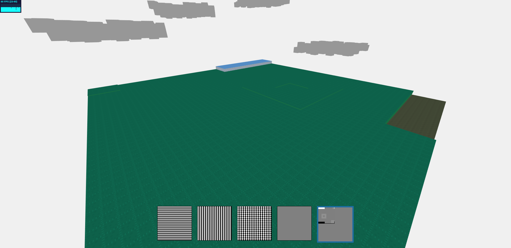
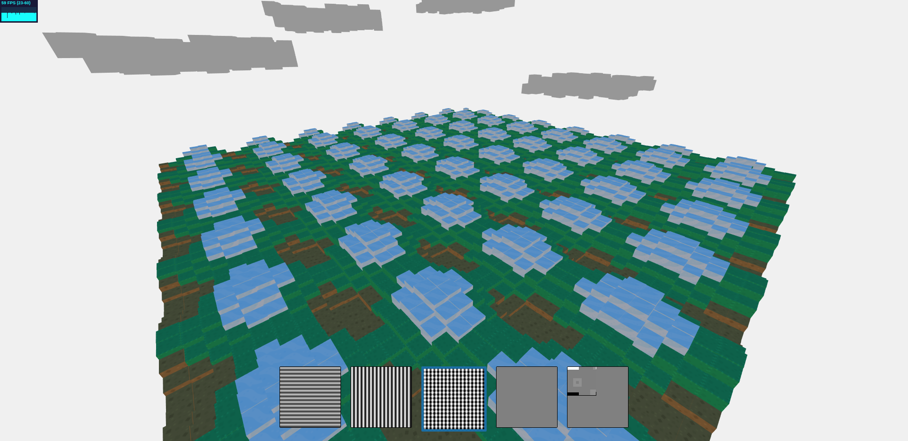

# Generazione di terreni procedurali

## Descrizione
Il progetto si propone di facilitare la creazione di terreni procedurali attraverso l'uso di classi chiamate generatori che, partendo da funzionalità base possono essere combinati per creare risultati più interessanti.
Per arrivare a questo risultato è stata creata una classe "astratta" Generator che possiede 2 metodi, `displacementFor`, che ritorna l'altezza per un punto (i,j) su una griglia 2D ad un particolare istante di tempo e `heightMap`, che prende queste altezze e ne genera un'oggetto di tipo HeightMap che successivamente può essere trasformato in un immagine.
Ogni generatore implementa il metodo `displacementFor` per ottenere un diverso comportamento, possiamo ignorare il tempo per terreni statici oppure tenerne conto per evolvere il terreno durante l'esecuzione (una montagna che periodicamente si abbassa oppure generazione di onde).
Sono stati implementati alcuni comportamenti come `WaveGenerator` che genera onde verso una certa direzione e `HeightMapGenerator` che, presa una HeightMap genera il corrispondente terreno ritornando l'altezza di ogni elemento della griglia.

Poi è stato implementato un generatore `MixGenerator` che permette di combinare 2 altri generatori con una regola definita dall'utente, anche `MixGenerator` è un generatore quindi possiamo combinarlo con altri generatori, formando una gerarchia che ci permette di definire la forma del nostro terreno.

Per creare e gestire la griglia 2D è stata creata la classe Grid2DLayout che inserisce gli oggetti forniti in una griglia rows x columns e ne gestisce la posizione e l'aggiornamento.

Per implementare il proprio generatore è sufficente implementare il metodo `displacementFor` della classe `Generator` (il metodo che crea l'HeightMap è già definito nella classe base), per vederlo in azione sul terreno basta istanziarlo ed aggiungerlo al vettore `generators`, chiamando poi `updateGenerators` per aggiornare l'interfaccia. 

L'animazione è creata utilizzando la classe `LinearInterpolator` che interpola linearmente tra 2 valori in base a un tempo di inizio dell'animazione e una durata.

## Risultati
Usiamo un `HeightMapDisplacementGenerator` per leggere una heightmap e ottenerne i valori di displacement per ogni cubo sulla griglia.

Sommando 2 `WaveDisplacementGenerator` che operano in 2 direzioni diverse otteniamo:

## Creazione della scena
Per creare la scena è stata usata principalmente la classe Grid2DLayout per creare e disporre il terreno e le nuvole.
Il terreno viene generato inizialmente leggendo l'HeightMap e può essere modificato tramite vari generatori presenti sul fondo della pagina, mentre le nuvole sono state create usando un `NoiseDisplacementGenerator`, poi aggiunte al nodo clouds che è stato aggiunto alla scena per gestire meglio il movimento di tutte le nuvole.
Mentre per le texture sono state usate alcune di quelle prese da [questo](https://www.kenney.nl/assets/voxel-pack) sito.
